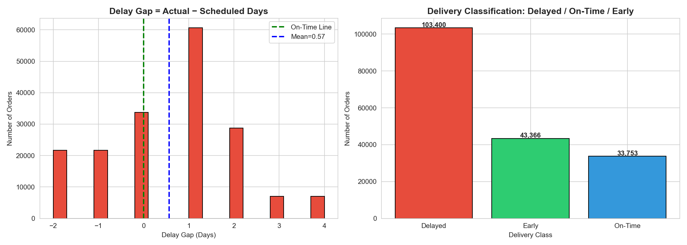
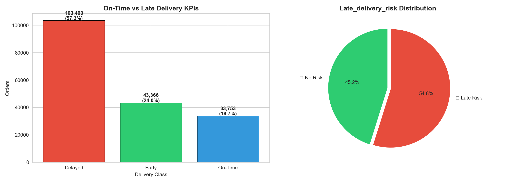
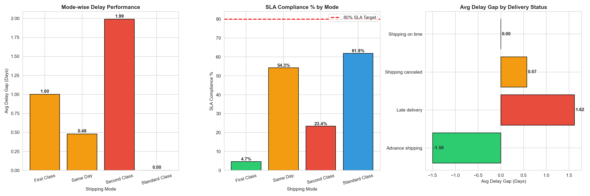
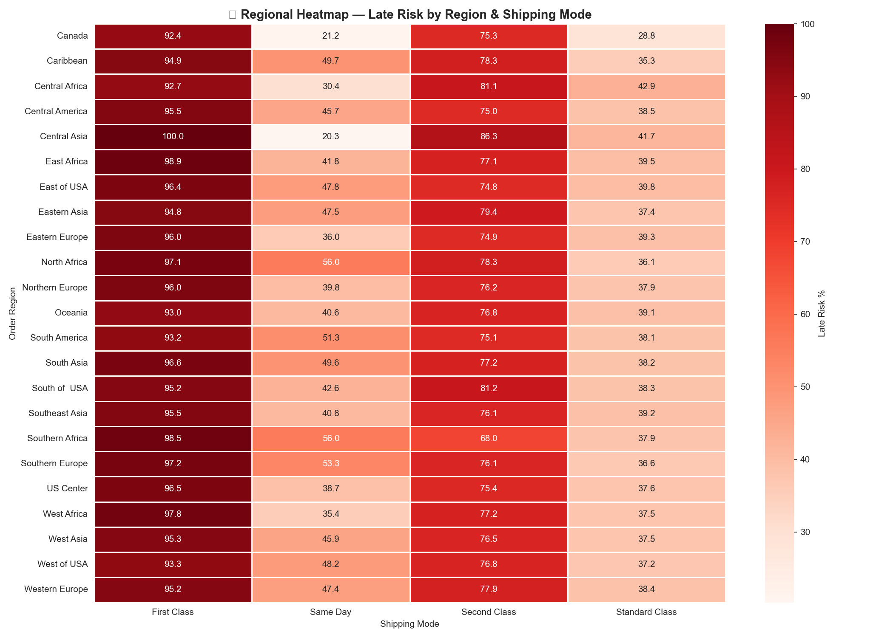
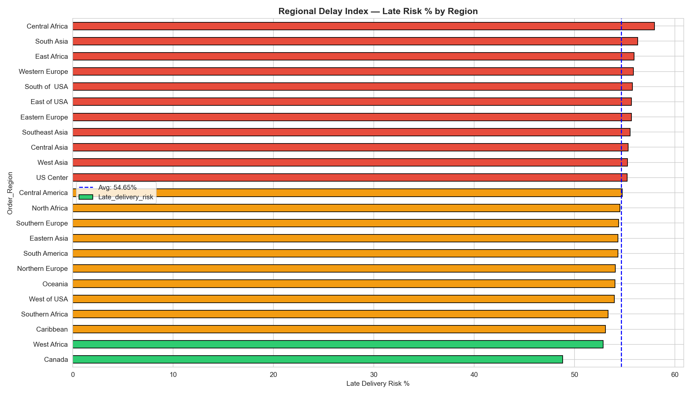
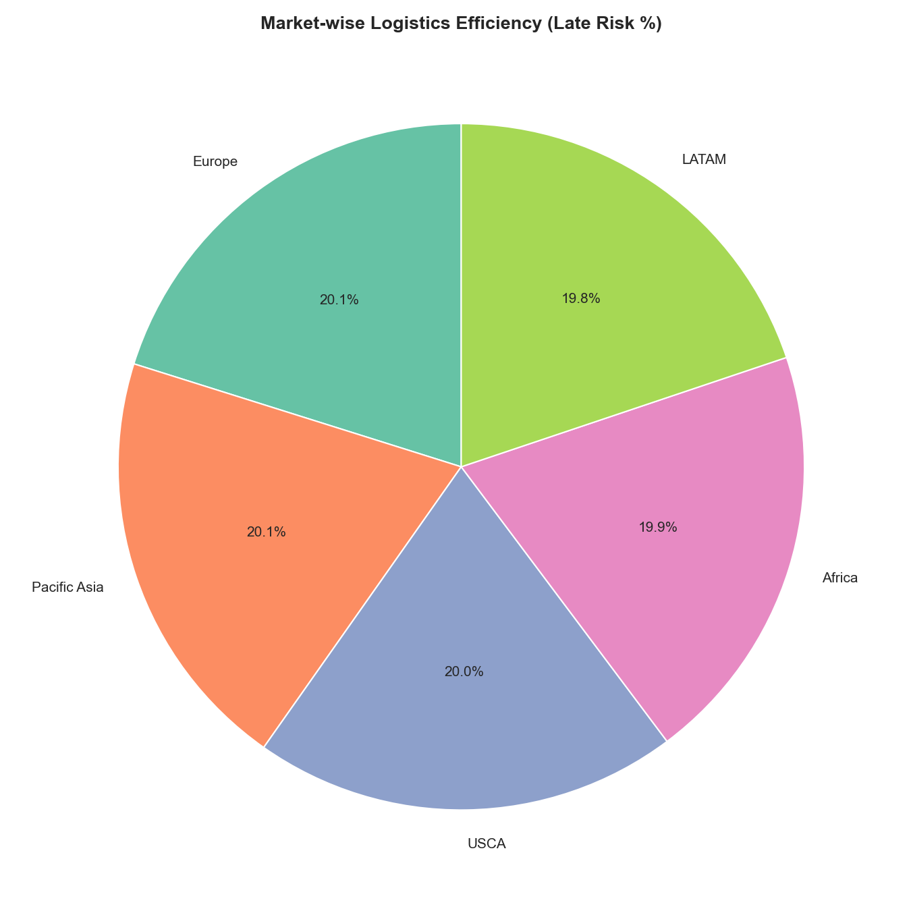
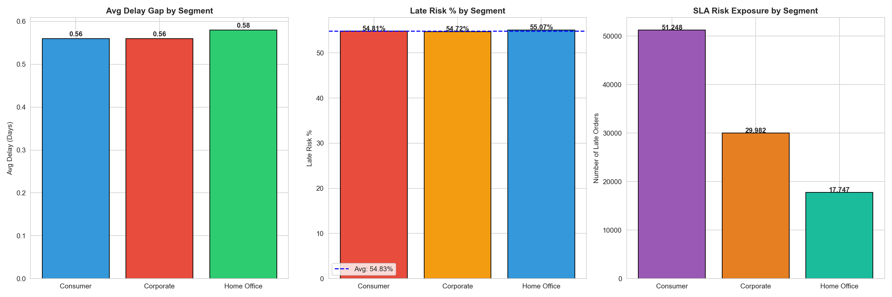

# 📦 APL Logistics — Delivery Performance & Supply Chain Analysis

  
  
  
  
  

  <b>Diagnostic Intelligence Layer for APL Logistics Global Supply Chain Operations</b>

---

## 🚀 Project Overview

This project performs comprehensive **Exploratory Data Analysis (EDA)**
of APL Logistics delivery performance across **23 global regions**
and **5 major markets**.

---

## 📊 Key KPIs

| KPI | Value | Status |
|-----|-------|--------|
| ✅ On-Time Delivery Rate | 18.70% | 🔴 Critical |
| ❌ Delayed Orders | 57.28% | 🔴 Critical |
| 🚨 Late Delivery Risk | 54.83% | 🔴 High |
| 📦 Total Orders | 1,80,519 | ✅ |
| 🚚 Best SLA Mode | Standard Class 61.93% | 🟡 |
| 🌍 Riskiest Region | Central Africa 57.96% | 🔴 |

---

## 📈 EDA Visualizations

### Step 2 — Delay Gap Calculation

### Step 3 — Delivery Performance

### Step 4 — Shipping Mode Efficiency

### Step 5 — Regional Heatmap

### Step 5 — Regional Delay Index

### Step 5 — Market Analysis

### Step 6 — Customer Segment Impact

---

## 🗂️ Project Structure
